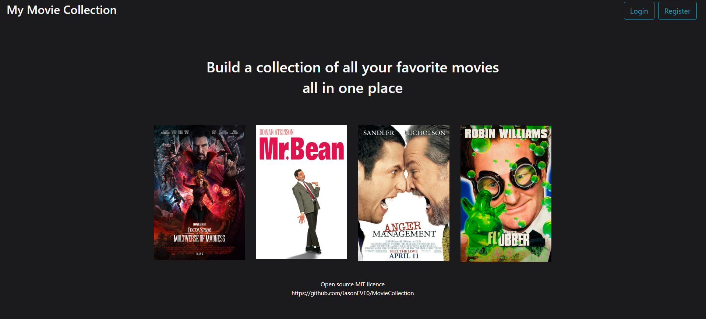
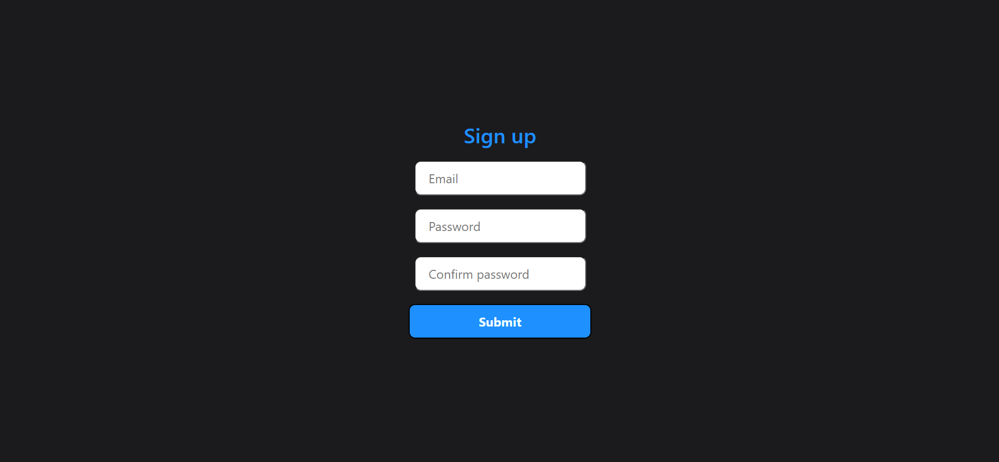
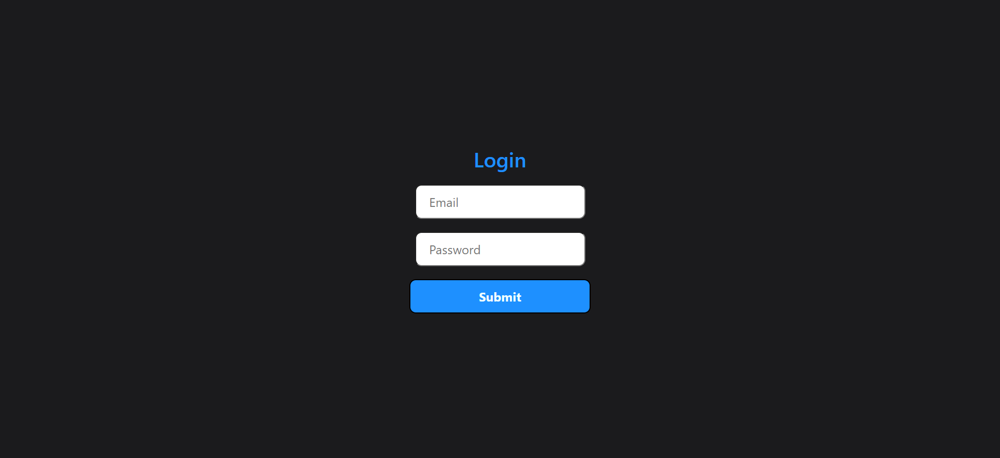
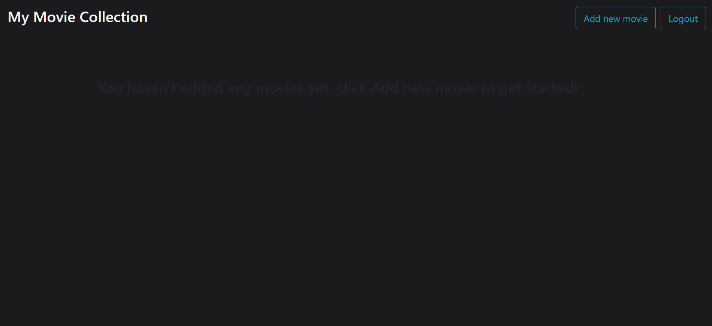
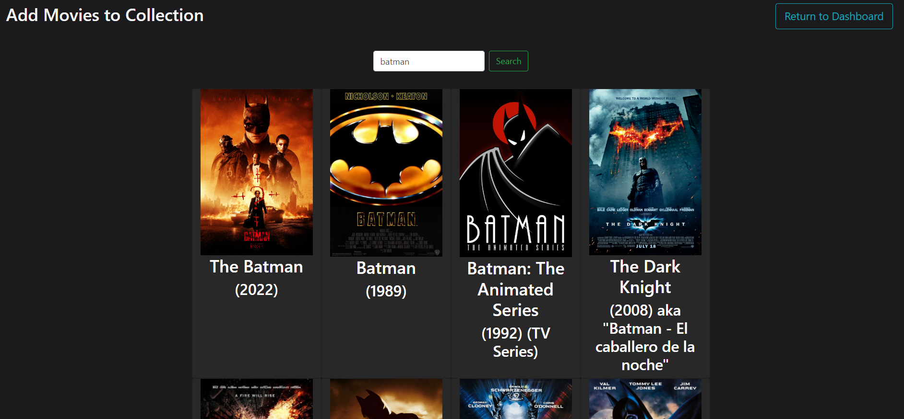
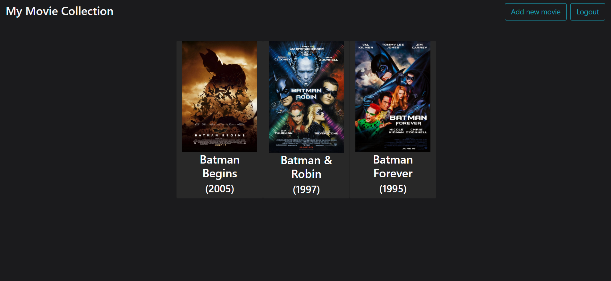

# MovieCollection
An open source web application which communicates with IMDB's API to generate a list of movies, a user can then add these movies to their private collection.

Made with React and Python Django
  

<em>Homepage</em>
   

<em>Registration page</em>
   

<em>Login page</em>
   

<em>New user dashboard</em>
   

<em>Searching for batman movies</em>
   

<em>Updated dashboard with a few batman movies added</em>
   

# Instructions
You need to install the necessary dependencies using pip install:
requests
django
djangorestframework
django-cors-headers

In the settings.py file you must provide and IMDB API key as the API_KEY variable, you can get these keys after registering an account at:
https://imdb-api.com/

You can start the server by navigating to the directory of the manage.py file and running:
python manage.py runserver
